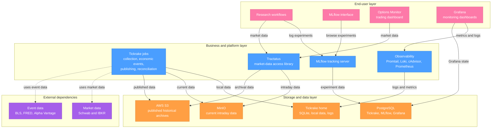

# Quant Platform Architecture

```mermaid
flowchart TB
    subgraph users["End-user layer"]
        direction TB
        research["Research workflows"]
        mlflowInterface["MLflow interface"]
        trading["Options Monitor<br/>trading dashboard"]
        operations["Grafana<br/>monitoring dashboards"]
    end

    subgraph services["Business and platform layer"]
        direction TB
        tickrake["Tickrake jobs<br/>collection, economic events,<br/>publishing, reconciliation"]
        mlflowTracking["MLflow tracking server"]
        tractatus["Tractatus<br/>market-data access library"]
        observability["Observability<br/>Promtail, Loki, cAdvisor, Prometheus"]
    end

    subgraph storage["Storage and data layer"]
        direction TB
        tickrakeHome["Tickrake home<br/>SQLite, local data, logs"]
        minio["MinIO<br/>current intraday data"]
        postgres["PostgreSQL<br/>Tickrake, MLflow, Grafana"]
        s3["AWS S3<br/>published historical archives"]
    end

    subgraph external["External dependencies"]
        direction TB
        marketData["Market data<br/>Schwab and IBKR"]
        eventData["Event data<br/>BLS, FRED, Alpha Vantage"]
    end

    research -->|"log experiments"| mlflowTracking
    mlflowInterface -->|"browse experiments"| mlflowTracking
    research -->|"market data"| tractatus
    trading -->|"market data"| tractatus
    operations -->|"metrics and logs"| observability
    operations -->|"Grafana state"| postgres

    mlflowTracking -->|"experiment data"| postgres
    tractatus -->|"intraday data"| minio
    tractatus -->|"archival data"| s3
    observability -->|"logs and metrics"| tickrakeHome
    tickrake -->|"local data"| tickrakeHome
    tickrake -->|"current data"| minio
    tickrake -->|"published data"| s3

    tickrake -.->|"uses market data"| marketData
    tickrake -.->|"uses event data"| eventData

    classDef user fill:#fd79a8,stroke:#d66a8e,color:#fff
    classDef service fill:#4a9eff,stroke:#2d7cd6,color:#fff
    classDef data fill:#ff9f43,stroke:#d68c3a,color:#fff
    classDef dependency fill:#a55eea,stroke:#8e4ec6,color:#fff

    class research,mlflowInterface,trading,operations user
    class tickrake,mlflowTracking,tractatus,observability service
    class tickrakeHome,minio,postgres,s3 data
    class marketData,eventData dependency
```
