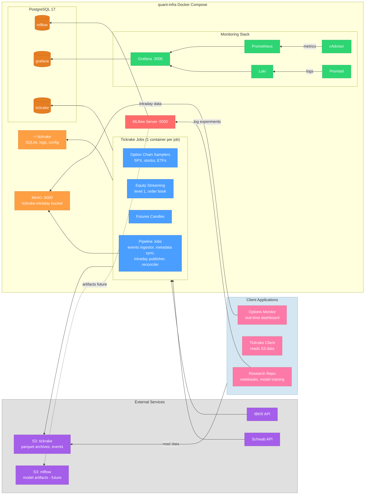

# Architecture Diagram

```mermaid
graph RL
    subgraph external["External Services"]
        schwab["Schwab API"]
        ibkr["IBKR API"]
        s3_tickrake["S3: tickrake<br/>parquet archives, events"]
        s3_mlflow["S3: mlflow<br/>model artifacts - future"]
    end

    subgraph quant_infra["quant-infra Docker Compose"]

        subgraph tickrake_jobs["Tickrake Jobs (1 container per job)"]
            options_sampler["Option Chain Samplers<br/>SPX, stocks, ETFs"]
            equity_streaming["Equity Streaming<br/>level 1, order book"]
            futures_job["Futures Candles"]
            pipeline["Pipeline Jobs<br/>events ingestor, metadata sync,<br/>intraday publisher, reconciler"]
        end

        subgraph postgres_cluster["PostgreSQL 17"]
            pg_mlflow[("mlflow")]
            pg_grafana[("grafana")]
            pg_tickrake[("tickrake")]
        end

        tickrake_home["~/.tickrake<br/>SQLite, logs, config"]
        minio["MinIO :9000<br/>tickrake-intraday bucket"]

        subgraph monitoring["Monitoring Stack"]
            grafana["Grafana :3000"]
            prometheus["Prometheus"]
            loki["Loki"]
            promtail["Promtail"]
            cadvisor["cAdvisor"]
        end

        mlflow["MLflow Server :5000"]
    end

    subgraph clients["Client Applications"]
        research["Research Repo<br/>notebooks, model training"]
        tickrake_client["Tickrake Client<br/>reads S3 data"]
        options_monitor["Options Monitor<br/>real-time dashboard"]
    end

    schwab --> tickrake_jobs
    ibkr --> tickrake_jobs

    tickrake_jobs --> s3_tickrake
    tickrake_jobs --> tickrake_home
    tickrake_jobs --> pg_tickrake
    pipeline --> minio

    promtail -->|logs| loki
    cadvisor -->|metrics| prometheus
    loki --> grafana
    prometheus --> grafana
    grafana --> pg_grafana

    mlflow --> pg_mlflow
    mlflow -.->|artifacts future| s3_mlflow

    research -->|log experiments| mlflow
    clients -->|read data| s3_tickrake
    options_monitor -->|intraday data| minio

    classDef job fill:#4a9eff,stroke:#2d7cd6,color:#fff
    classDef store fill:#ff9f43,stroke:#d68c3a,color:#fff
    classDef db fill:#e67e22,stroke:#c96b1a,color:#fff
    classDef monitor fill:#2ed573,stroke:#26b862,color:#fff
    classDef ext fill:#a55eea,stroke:#8e4ec6,color:#fff
    classDef app fill:#ff6b6b,stroke:#d65c5c,color:#fff
    classDef client fill:#fd79a8,stroke:#d66a8e,color:#fff

    class options_sampler,equity_streaming,futures_job,pipeline job
    class minio,tickrake_home store
    class pg_mlflow,pg_grafana,pg_tickrake db
    class grafana,prometheus,loki,promtail,cadvisor monitor
    class schwab,ibkr,s3_tickrake,s3_mlflow ext
    class mlflow app
    class research,tickrake_client,options_monitor client

    style external fill:#e0e0e0,stroke:#999,color:#333
    style clients fill:#d4e6f1,stroke:#85b1d4,color:#333
```
